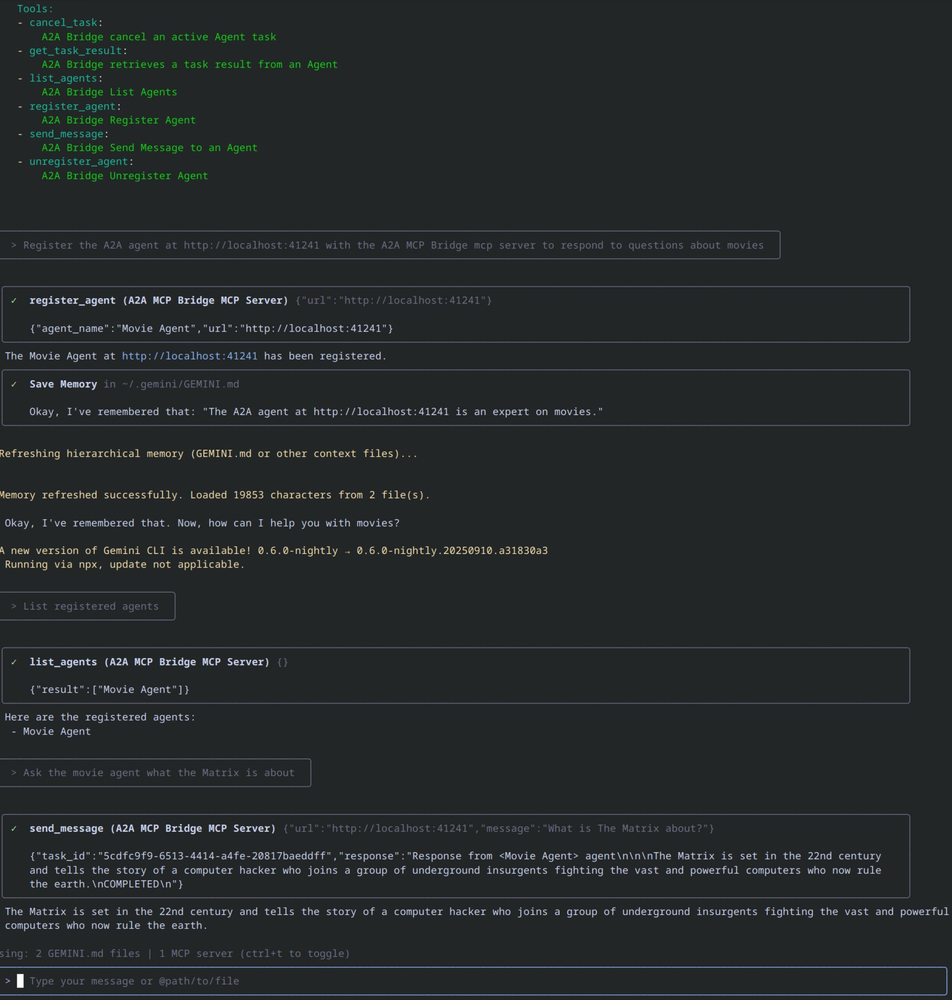

# a2a

This package provides an SDK for the Agent 2 Agent(A2A) protocol which provides 
an open protocol enabling communication and interoperability between opaque agentic 
applications. Please see [here](https://github.com/a2aproject/A2A) for the A2A project overview.
This package assumes some familiarity with the A2A project in terms of goals, terminology etc.
Some key concepts are :-

* A2A Client: An application or agent that initiates requests to an A2A Server on behalf of a user or another system.
* A2A Server (Remote Agent): An agent or agentic system that exposes an A2A-compliant HTTP endpoint, processing tasks and providing responses.
* Agent Card: A JSON metadata document published by an A2A Server, describing its identity, capabilities, skills, service endpoint, and authentication requirements.
* Message: A communication turn between a client and a remote agent, having a role ("user" or "agent") and containing one or more Parts.
* Task: The fundamental unit of work managed by A2A, identified by a unique ID. Tasks are stateful and progress through a defined lifecycle.
* Part: The smallest unit of content within a Message or Artifact (e.g., TextPart, FilePart, DataPart).
* Artifact: An output (e.g., a document, image, structured data) generated by the agent as a result of a task, composed of Parts.
* Streaming (SSE): Real-time, incremental updates for tasks (status changes, artifact chunks) delivered via Server-Sent Events.
* Push Notifications: Asynchronous task updates delivered via server-initiated HTTP POST requests to a client-provided webhook URL, for long-running or disconnected scenarios.
* Context: An optional, server-generated identifier to logically group related tasks.
* Extension: A mechanism for agents to provide additional functionality or data beyond the core A2A specification.

For detailed explanations, please refer to the [Key Concepts](https://a2a-protocol.org/latest/topics/key-concepts/) guide.


Specifically the package implements an A2A SDK for Dart, modelled from the JavaScript
SDK that can be found [here](https://github.com/a2aproject/a2a-js).

The SDK consists of the following components :-

## The A2A Client

The A2A client(A2AClient) provides the client API for an agent. This allows users to send messages, streaming messages
using SSE responses, fetching of an agents agent card and other management functions such as
agent configuration and task resubscription.

##### Key Features :-

* JSON-RPC Communication: Handles sending requests and receiving responses (both standard and streaming via Server-Sent Events) according to the JSON-RPC 2.0 specification.


* A2A Methods: Implements standard A2A methods like sendMessage, sendMessageStream, getTask, cancelTask, setTaskPushNotificationConfig, getTaskPushNotificationConfig, and resubscribeTask.


* Error Handling: Provides basic error handling for network issues and JSON-RPC errors.


* Streaming Support: Manages Server-Sent Events (SSE) for real-time task updates (sendMessageStream, resubscribeTask).

Annotated examples of use for the A2AClient to communicate with a test agent can be found in the examples directory, 
[here](https://github.com/shamblett/a2a/blob/main/example).

## The A2A CLI Client

The A2A CLI client(a2a_cli_client) provides a simple CLI client for interacting with an agent.
The client supports fetching and display of an agents agent card, querying of an agent using normal send message
or streaming requests if streaming is supported.

Responses are handled and displayed to the user to allow visibility of the request/response
interplay between the client and the agent for a particular request.

The client supports the following commands that can be entered at the prompt :-

* /exit - exits the client.
* /new - starts a new session by clearing any current task and context information.
* /resub - attempts to resubscribe an already started task if the SSE event stream for a previous task has been broken.

THh client is installed in the usual manner i.e. 
```
dart pub global activate a2a
```
This will give you command line access to the a2a_cli_client.

## The A2A Server(Remote Agent)

The A2AServer(A2AServer) is a server implementation for the Agent-to-Agent (A2A) communication protocol, 
built atop of the [Darto](https://pub.dev/packages/darto) microframework, 
a package inspired by the Node.js [Express](https://expressjs.com/) framework for building web applications.

Implementation of an A2A Agent involves 3 steps :-

* Define the Agents Agent Card.
* Implement an Executor for the Agent
* Start the server

### Agent Executor

Developers are expected to implement this interface and provide two methods: execute and cancelTask.

#### execute :
This method is provided with a RequestContext and an EventBus to publish execution events.
The executor can either respond by publishing a Message or Task.

For a task, it should check if there's an existing task in the RequestContext. If not it should publish an initial Task event 
using the taskId & contextId from the RequestContext.

The executor should subsequently publish TaskStatusUpdateEvent or 
TaskArtifactUpdateEvent(s).

The executor should indicate which is the final event.

The executor should also check if an ongoing task has been cancelled. 
if it has, the execution should be cancelled and TaskStatusUpdateEvent 
with its state set to cancelled emitted.

#### cancelTask
The executor should implement cancellation mechanism for an ongoing task.

A fully annotated example of creating an A2A Agent in this manner can be found in the 
[a2a_server_agent](https://github.com/shamblett/a2a/blob/main/example/a2a_server_agent.dart) 
example. This example is an implementation of the Executor example found on the A2A site.

An implementation of the helloworld agent provided as part of the A2A Samples repository can be found
in the [a2a_server_agent_helloworld](https://github.com/shamblett/a2a/blob/main/example/a2a_server_agent_helloworld.dart)
example. This example is an implementation of the helloworld agent sample.

fully annotated example of creating an A2A Agent that queries LLM's can be found in the  
[a2a_server_agent](https://github.com/shamblett/a2a/blob/main/example/a2a_server_agent_ollama.dart)
example. This example uses a local Ollama installation to query two selected LLM's so their responses can be compared.
It uses the A2A Executor Construction(A2AExecutorConstructor class) to greatly simplify the construction
of the executor. It also uses the [llm_dart](https://pub.dev/packages/llm_dart) package to perform the heavy lifting of communicating with
Ollama.

## Sample agents

Several sample agents implemented in various languages can be found in the A2A project samples directory [here](https://github.com/a2aproject/a2a-samples).

Sample agent implementations for Dart can be found [here](https://github.com/shamblett/a2a-dart-samples)

## Protocol implementation notes

This SDK implements the A2A Protocol Specification found [here](https://a2a-protocol.org/latest/specification/)
with the following notes :-

* Only the JSON-RPC 2.0 transport is currently supported.
* Authentication/Authorisation as outlined in section 4 of the specification(excepting HTTPS support) is not supported. 
_The JS SDK which this package was ported from did not contain this_

## Server implementation notes

* The Send Message client method can be configured as blocking or non-blocking. The client supports
  selection of this however the server will always treat the request as blocking.

## The A2A MCP Bridge

An MCP server that bridges the Model Context Protocol (MCP) with the Agent-to-Agent (A2A) protocol, enabling MCP-compatible AI assistants (like Gemini, Claude etc.) to seamlessly interact with A2A agents.

The A2A MCP Bridge serves as an integration layer between two cutting-edge AI agent protocols:

- **Model Context Protocol (MCP)**: Developed by Anthropic, MCP allows AI assistants to connect to external tools and data sources. It standardizes how AI applications and large language models connect to external resources in a secure, composable way.

- **Agent-to-Agent Protocol (A2A)**: Developed by Google, A2A enables communication and interoperability between different AI agents through a standardized JSON-RPC interface.

By bridging these protocols, this server allows MCP clients to discover, register, communicate with, and manage tasks on A2A agents through a unified interface.

The A2A MCP Bridge currently supports the streamable-http HTTP transport. Other transports 
will be added in future versions.

The MCP Bridge supports the following tools -

- cancel_task: &nbsp;Cancel an active Agent task
- get_task_result: &nbsp; Retrieves a task result from an Agent
- list_agents: &nbsp; List Agents
- register_agent: &nbsp; Register an Agent for later use
- send_message: &nbsp; Send a message to an Agent
- unregister_agent: &nbsp; Unregister Agent

The main  use case for the server is to register an agent, send it messages and when finished unregister the agent.


The MCP Bridge can be integrated with any MCP aware AI assistants such as Claude, Windsurf and Cursor.
An example integration with the Gemini CLI assistant is shown below.

### Integration with Gemini CLI

Firstly update your Gemini settings.json file with the following - 
```
 "mcpServers": {
    "A2A MCP Bridge": { "httpUrl": "http://localhost:3080/mcp",
      "timeout": 30000,
      "trust": true
      }
    }
```

Then start the server(see the [a2a_mcp_bridge.dart](https://github.com/shamblett/a2a/blob/main/example/a2a_mcp_bridge.dart) example)

Now start Gemini CLI, you should see the MCP Bridge listed and connected, pressing ctrl-t should give -
```
ℹConfigured MCP servers:

  🟢 A2A MCP Bridge - Ready (6 tools)
    Tools:
    - cancel_task:
        A2A Bridge cancel an active Agent task
    - get_task_result:
        A2A Bridge retrieves a task result from an Agent
    - list_agents:
        A2A Bridge List Agents
    - register_agent:
        A2A Bridge Register Agent
    - send_message:
        A2A Bridge Send Message to an Agent
    - unregister_agent:
        A2A Bridge Unregister Agent
```
You can now register your agents and ask them questions. The following screenshot shows Gemini CLI
interacting with the Movie Agent sample to answer questions about movies.



A more complete conversation with Gemini CLI and the Movie Agent can be found [here](https://github.com/shamblett/a2a/blob/main/example/mcp/conversation.txt).
